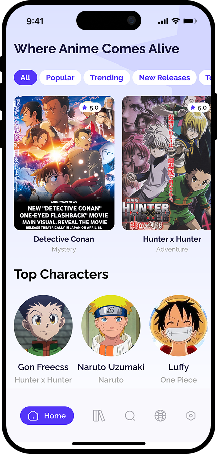
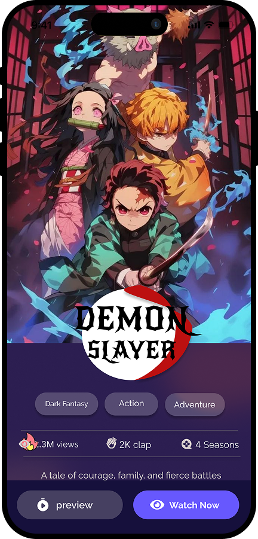
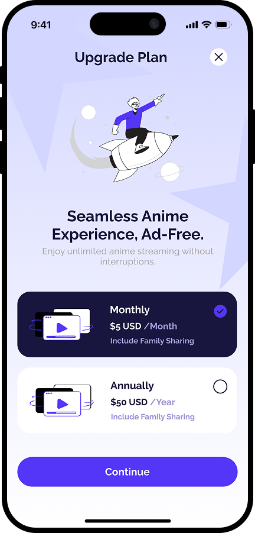

# 🎬 Anime App UI (Flutter)

A mini **Flutter UI project** that showcases an anime details screen design.  
This project focuses on **clean layout, modern design, and custom styling** using Flutter widgets.

---

## 📱 Screenshots

<p align="center">
  
  
  
</p>

---

## 🚀 Features
- 📖 **Anime details page** with poster, title, tags, and description.  
- 🎨 **Modern and stylish UI** with gradient buttons and card design.  
- 🔘 Interactive buttons: *Preview* & *Watch Now*.  
- 🏷️ Genre tags (Action, Adventure, Dark Fantasy).  
- 📊 Stats section (views, claps, seasons).  
- 📂 Organized folder structure for scalability.  

---

## 🛠️ Technologies Used
- **Flutter** (latest stable SDK)  
- **Dart** for UI logic  
- **Material Design** components  
- Custom fonts & styling  

---

## ▶️ How to Run
1. Clone this repo:
   ```bash
   git clone https://github.com/USERNAME/AnimeApp-UI.git
